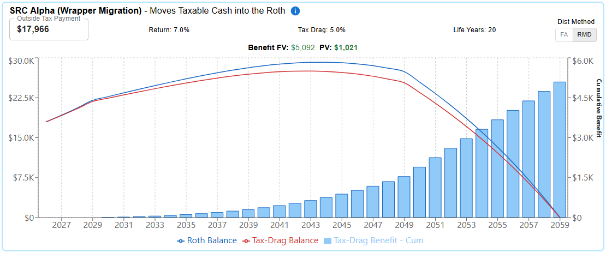
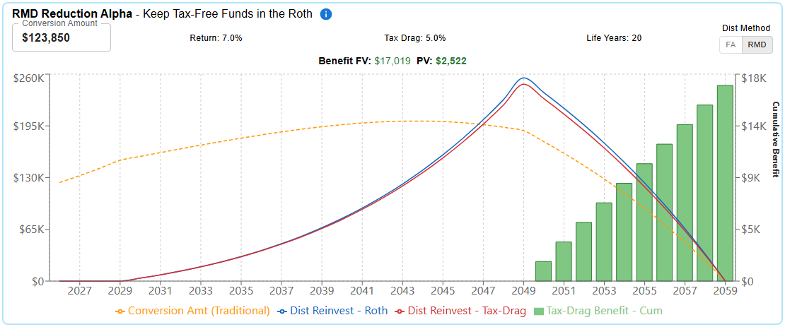

# Quantifying Tax-Drag Shelter Benefits in Roth Conversions

**RMD Reduction and the Hidden Roth Contribution**

Steven Cheshire, CFA  
cheshiresteven@gmail.com | Draft: June 4, 2026

---

## Abstract

Roth conversions generate alpha by sheltering assets from the tax drag inherent in taxable accounts — tax-drag shelter (TDS). Yet TDS is rarely priced in conversion analysis. This paper isolates two alpha sources, each tied to a specific planner decision: RMD-reduction alpha, created when all conversions reduce future RMDs; and Synthetic Roth Contribution (SRC) alpha, created when an Outside-funded conversion migrates conversion-tax dollars into the Roth — the wrapper-migration premium over taxable counterfactual growth. Both follow the valuation identity, $\alpha = P \cdot \mu$, where $P$ is sheltered principal and $\mu$ is the per-dollar present value of the yearly distribution gap between parallel sheltered and taxable growth paths. These yearly gaps also feed an Outside-funded conversion's IRR as drag-related cash flows. RMD-reduction alpha dominates SRC alpha because it scales with converted principal $C$ rather than with $\tau_C \cdot C$. Additionally, RMD-reduction alpha increases with life expectancy, while SRC alpha is relatively insensitive to it since Phase-1 distributions are self-limiting.

---

## Executive Summary

- **Tax-Drag Shelter (TDS)** is the present-value gap between holding investments inside vs. outside a tax-advantaged wrapper — widely recognized as an effect, seldom priced as a distinct PV line item in Roth-conversion analysis.
- A Roth conversion produces two distinct TDS alphas: **RMD-reduction alpha** (from the Conversion decision) and **SRC alpha** (from the Outside-settlement choice).
- Both alphas are special cases of a single valuation identity: the present value of the distribution gap between sheltered and taxable growth paths.
- **SRC alpha is wrapper-migration differential, not full Roth growth of $K$.** A "Hidden Contribution" counts the full sheltered future value $K(1+r)^T$, implicitly assuming $K$ would have done nothing absent conversion. The counterfactual's taxable growth is $\tilde{r}$, so wrapper-migration alpha is $K[(1+r)^T - (1+\tilde{r})^T]$.
- RMD-reduction alpha dominates SRC alpha because it scales with converted principal $C$ rather than with $\tau_C \cdot C$.
- RMD-reduction alpha increases with life expectancy, while SRC alpha is relatively insensitive to it since Phase-1 distributions are self-limiting.

---

## 1. Tax-Drag Shelter

**Tax-Drag Shelter (TDS)** is the present-value gap between holding investments inside vs. outside a tax-advantaged wrapper. Inside, investments grow unencumbered by taxes; outside, the same dollars pay annual tax on dividends, interest, realized capital gains, and turnover-driven distributions — a drag that compounds materially over time.

A Roth conversion can capture this benefit in two ways, each creating positive alpha.

1. **RMD-reduction alpha (primary):**

    All conversions (Inside & Outside) reduce the Traditional account by an amount $C$, causing reduced future RMDs. RMD reductions that would have been reinvested taxably remain sheltered. **RMD-reduction alpha** is the PV of that sheltering.

2. **SRC alpha (secondary):**

    Outside-funded conversions migrate $K$ ($\tau_C \cdot C$) after-tax dollars into the Roth wrapper — **a hidden Roth contribution**, formally a **Synthetic Roth Contribution** (SRC; Cheshire 2026). **SRC alpha** is the PV gain of $K$ compounding tax-free as it distributes vs. in the taxable counterfactual. Identical alpha accrues to a same-sized statutory Roth contribution.

---

## 2. Worked Example

Converting \$123,850 fills through the 22% bracket, with an effective tax rate of 14.5%.

**Inputs.**

| Parameter | Symbol | Value |
|---|---|---|
| Pre-tax return | $r$ | 7% |
| Tax-drag rate | $d$ | 5% |
| After-drag return | $\tilde{r} = r(1-d)$ | 6.65% |
| Conversion principal | $C$ | \$123,850 |
| Conversion-year effective rate | $\tau_C$ | 14.5% |
| Conversion tax | $K = \tau_C \cdot C$ | \$17,966 |
| Owner remaining life | | 23 years (69–92) |
| Beneficiary period | | 10 years |
| RMD reinvestment | $\rho$ | 75% |

**The two alphas — Outside- vs. Inside-funded tax payment:**

| Component | Outside payment | Inside payment |
|---|---|---|
| RMD-reduction alpha | \$2,522 | \$2,522 |
| SRC alpha | \$1,021 | \$0 |
| **TDS total** | **\$3,543** | **\$2,522** |
| Conversion IRR | 11.56% | undefined (no outlay) |

**Interpretation.** Inside- and Outside-funded conversions both yield \$2,522 RMD-reduction alpha. Outside funding adds \$1,021 SRC alpha. RMD alpha is 2.47× larger, effectively scaling with $(1-\tau_C)\cdot C\cdot \rho = $ \$79,419, vs. $K = $ \$17,966 — 4.42×. SRC's smaller principal earns a higher per-dollar multiplier ($\mu_{SRC} \approx 0.057$ vs. $\mu_{RMD} \approx 0.032$), but not enough to overcome RMD's 4.42× principal advantage.

All Roth conversions produce RMD-reduction alpha while only Outside conversions create SRC alpha. Outside's 11.56% IRR is the 7% base plus rate-arbitrage (\$13,280) + Medicare (\$1,028) + TDS (\$3,543) alphas. TDS contributes 19.8% of that alpha, which may be on the small side: our example's rate-arbitrage alpha is inflated by the Social Security tax-torpedo impact, so typical conversions may have a larger TDS share.

Appendix D gives the per-year RMD and SRC drag flows in nominal and PV terms; §7 shows sensitivity to longer life, higher drag, and reinvestment share.

---

## 3. The Drag-Shelter Valuation Identity

A common process creates both TDS alphas: run two parallel accounts on a shared distribution schedule — one sheltered at $r$, one taxable at $\tilde{r}$ — and sum the PV of the yearly distribution gap. For principal $P$, the **drag-shelter multiplier** $\mu_P$ is this per-dollar sum (derivation in Appendix A; simulator in Appendix B):

$$
\alpha \;=\; P \cdot \mu_{P}.
$$

§4 specializes the calculation twice. SRC alpha applies it to principal $K$, distributed on the planner's chosen schedule across owner life and the 10-year beneficiary annuity. RMD-reduction alpha applies it to avoided-RMD dollars that accumulate during owner life, then distribute over the 10-year beneficiary annuity only.

---

## 4. The Two TDS Alphas

### 4.1 SRC alpha — Outside-funded conversions only

Specializing §3 with $P = K$,

$$
\alpha_{SRC} \;=\; K \cdot \mu_{SRC}.
$$

**Two-stage construction (RMD distribution).** Phase 1 (owner-life): $K$ compounds in two parallel balances — sheltered at $r$, taxable at $\tilde{r}$ — and distributes each year via the RMD divisor. The yearly sheltered-vs-taxable distribution gap accrues as alpha. Phase 2 (beneficiary period): the residual distributes as a 10-year fixed annuity (FA); the same gap mechanic continues. Appendix B.1 gives the construction. (Under FA distribution, Phase 1 is itself a fixed annuity across owner life — no separate Phase 2.)

**Inside payment.** No wrapper migration occurs, so $\alpha_{SRC} = 0$.

SRC alpha is the drag-avoidance component of total SRC value; Appendix A.1 splits it from the taxable-side growth term.

**Figure 1.** SRC alpha. $K$ = \$17,966 conversion-tax dollars compound in a sheltered Roth vs. a taxable counterfactual (drag $d$ = 5%), distributing under RMD, then FA for beneficiary; the per-year gap accrues PV = \$1,021.

### 4.2 RMD-reduction alpha — Inside- and Outside-funded conversions

The principal being sheltered is the after-tax converted balance scaled by the reinvestment share, $P = (1-\tau_C) \cdot C \cdot \rho$. Specializing §3 on the avoided-RMD schedule,

$$
\alpha_{RMD} \;=\; (1-\tau_C) \cdot C \cdot \rho \cdot \mu_{RMD}.
$$

Because RMD divisors $\varepsilon_t$ depend on age, not balance, the avoided-RMD stream scales linearly in $C$, justifying the use of the scaling principal $(1-\tau_C) \cdot C \cdot \rho$ in the identity above. The multiplier $\mu_{RMD}$ (Appendix B.2) prices the drag-shelter value per dollar of that scaling principal.

**Two-stage construction.** Phase 1 (owner-life): each year's avoided RMD enters two parallel balances — sheltered at $r$, taxable at $\tilde{r}$. Nothing distributes; the owner-life drag accumulates in the balance gap. Phase 2 (beneficiary period): under the SECURE-Act 10-year mandate, both balances distribute as a 10-year fixed annuity, and the yearly sheltered-vs-taxable gap delivers the alpha. Phase 2 is identical in structure to SRC alpha's Phase 2.

$\rho$ is the surplus-wealth reinvestment share; consumed RMDs cancel across conversion and counterfactual paths and are out of scope.

**Figure 2.** RMD-reduction alpha. Avoided RMDs reinvest in parallel sheltered and taxable balances during Phase 1 (owner life); both distribute as a 10-year fixed annuity in Phase 2 (beneficiary period). Cumulative drag-avoidance benefit reaches PV = \$2,522.

Both figures show balances depleting to zero — owner-life RMDs plus SECURE-mandated 10-year beneficiary distribution form a bounded schedule that admits closed-form PV (and IRR for SRC alpha).

### 4.3 Total TDS alpha

Under Outside payment,

$$
\alpha_{TDS} \;=\; \alpha_{SRC} \;+\; \alpha_{RMD}.
$$

Under Inside payment, $\alpha_{TDS} = \alpha_{RMD}$ since no wrapper migration occurs and $\alpha_{SRC} = 0$.

Both alphas also feed the conversion's IRR through yearly drag-related cash flows — the SRC flow over owner-life and beneficiary distributions, the RMD-reduction flow over the beneficiary period — so a planner can attribute a quantified share of the deployed IRR to drag avoidance. Appendix C gives the per-year definitions. Under Inside payment (no user outlay) the conversion IRR is undefined and the RMD-reduction PV stands alone.

---

## 5. Literature Review

Published treatment of tax drag as a quantified, named PV line item in the Roth-conversion setting is sparse. Five entries illustrate this gap.

**McQuarrie & DiLellio (2023), "The Arithmetic of Roth Conversions,"** *Journal of Financial Planning*. Equation 4 and Tables 4–5 reinvest after-tax counterfactual RMDs at $r(1-d)$ while the Roth compounds at $r$, establishing that drag compounds rather than accruing linearly. The present paper expands this framework by embedding the full SECURE 2.0 distribution schedule — owner-life RMDs followed by 10-year beneficiary depletion — into the same arithmetic. That bounded schedule is the load-bearing addition: absent a terminal distribution schedule, the after-tax wedge remains open-ended and a breakeven age is the natural output. Closing the schedule at the legally mandated terminus turns the same wedge into a finite cash-flow stream that admits a closed-form PV and an IRR, which is what lets us price RMD-reduction alpha as a separate per-decision line item rather than report it as a breakeven scalar.

**Reichenstein & Meyer (2017), "Valuing Roth Conversion and Recharacterization Options,"** *Journal of Financial Planning* 30(11): 48–56. Their Strategy 3 (outside-funded conversion) vs Strategy 2 (inside-funded) comparison computes $tV(1+r)^n - tV(1+R)^n$, the drag wedge on the conversion-tax dollars — algebraically what the present paper isolates as SRC alpha. R&M do not extend this to the RMD-reduction channel: the avoided-RMD stream sheltered from drag (the dominant alpha in most conversions) is not separately priced, and the common drag structure linking the two channels is not separately identified. Results are reported as FV ratios at the withdrawal year rather than PV at the conversion year.

**Vanguard BETR (Passman, Wong & Dickson 2025).** Computes Jill's break-even future tax rate from Roth multiple $M = 3$, taxable multiple $M' = 2$, and $n = 20$; $\tau_D = 23.3\%$ — our equivalent embedded drag $d = 1 - \dfrac{M'^{1/n} - 1}{M^{1/n} - 1} \approx 37.5\%$ (Cheshire 2026, §6). The framings are algebraically identical, yet 23.3% vs. Jill's expected 24% reads as plausible; the equivalent tax-drag rates of 37.5% and 34.95% (from $M' = M(\tau_D/\tau_C) = 2.057$) may appear less so. Viewed through the present framework, BETR can be re-expressed as an implied tax-drag assumption: the break-even on $\tau_D$ is algebraically a break-even on $d$, with $d \approx 37.5\%$ as the implied figure in Jill's case. The reframing substitutes a future statutory rate for an embedded portfolio-level drag the planner can estimate and influence.

**Mike Piper, "The 4 Effects of a Roth Conversion."** Names the Outside-payment benefit and the RMD-reduction benefit qualitatively but does not quantify either or produce PV/IRR figures.

**Kitces.** Acknowledges the Outside-payment benefit and account-level drag qualitatively; does not isolate the conv-tax dollar's $r(1-d)$ counterfactual as a PV or IRR line item.

Across these treatments, tax drag appears as an embedded assumption, breakeven condition, or qualitative benefit — rather than as two separately priced PV alphas corresponding to the planner's two distinct decisions: whether to convert, and conditional on converting, whether to fund the tax from inside or outside assets.

To our knowledge, no prior Roth-conversion study reports the drag avoided on the counterfactual reinvestment of eliminated RMDs as a separately priced present-value component of conversion value.

---

## 6. Contribution

This paper adds three things to the Roth-conversion literature.

1. **PV identification of two distinct alphas, organized as a decision hierarchy.** RMD-reduction alpha (created by the Conversion decision) and SRC alpha (created by the Outside-settlement decision) are each expressed as $P \cdot \mu_P$ for the relevant principal. The decision-hierarchy framing — RMD-reduction alpha first, SRC alpha second — clarifies what each planner decision actually buys and makes the Inside-vs-Outside contrast immediate.

2. **Correcting the implicit zero-growth taxable counterfactual.** The conventional Hidden Contribution figure equates the conv-tax dollar's value with its full sheltered-wrapper future value — implicitly assuming it would have done nothing absent conversion. The counterfactual is taxable growth at $\tilde{r}$. The TDS framing extracts only the sheltered-vs-taxable differential as drag-avoidance value, leaving the would-have-grown-anyway portion correctly attributed to the conv-tax dollar regardless of conversion. (Appendix A.1 gives the decomposition.)

3. **Conversion IRR attributable to drag avoidance.** The two alphas pin down which slice of an Outside-funded conversion's IRR is delivered by drag avoidance rather than by rate arbitrage (Inside payment has no IRR). Per-year definitions and the legitimacy argument are in Appendix C.

The contribution is isolation and quantification, not discovery of the underlying intuition.

---

## 7. Conclusion

Three implications for conversion planning.

1. **Judge the Conversion decision on RMD-reduction alpha alone.** It applies to both Inside- and Outside-funded conversions, scales with $C$ and is the dominant TDS alpha.

2. **Judge the Outside-settlement decision (paying conversion tax with outside funds) on SRC alpha.** It captures the value of moving $K$ dollars into the Roth — identical to what a same-sized statutory Roth contribution gains.

3. **Attribute, don't aggregate.** Reporting a single conversion IRR conflates rate arbitrage, Medicare effects, and drag shelter. The two alphas let a planner show clients which slice of the IRR each decision actually buys, and which assumptions ($\tau_C$, $d$, $\rho$, owner life) drive which slice.

**Sensitivity considerations.**

| Parameter Change | SRC Alpha | RMD Alpha |
|---|---|---|
| Longer life | ↗ | ↑ |
| Higher drag $d$ | ↑ | ↑ |
| Higher RMD reinvestment $\rho$ | — | ↑ |

**Magnitude examples (base + parameter variations).**

| Scenario | RMD-reduction alpha | SRC alpha | RMD/SRC | TDS total |
|---|---:|---:|---:|---:|
| Base ($L$=23, $d$=5%) | \$2,522 | \$1,021 | 2.47× | \$3,543 |
| Longer life ($L$=28) | \$3,605 | \$1,055 | 3.42× | \$4,660 |
| Higher drag ($d$=7%) | \$3,495 | \$1,410 | 2.48× | \$4,905 |
| Both ($L$=28, $d$=7%) | \$4,985 | \$1,455 | 3.43× | \$6,440 |

RMD-reduction alpha is highly time-sensitive: longer life extends Phase 1 accumulation, producing a larger Phase 2 starting balance. SRC alpha is self-limiting: extending Phase 1 distributes more of $K$, shrinking the Phase 2 residual — Phase 1 gains roughly offset Phase 2 shrinkage. For RMD-reduction, $L$ and $d$ compound: changing both increases alpha by \$2,463 — ~\$407 more than their individual sum (\$1,083 + \$973 = \$2,056).

**Takeaway.** Tax-drag shelter is captured predominantly through the RMD-reduction channel — available to both Inside- and Outside-funded conversions — while the wrapper-migration benefit of Outside funding is the smaller, less time-leveraged piece.

---

## Appendix A. The Drag-Avoidance Value Identity

**Notation.** The following symbols are used throughout Appendices A–C.

| Symbol | Meaning |
|---|---|
| $S$ | Sheltered wrapper; compounds at $r$ |
| $U$ | Unsheltered taxable wrapper; compounds at $\tilde{r} = r(1-d)$ |
| $B^{S}_t, B^{U}_t$ | Balance at time $t$ in each wrapper |
| $A^{S}_t, A^{U}_t$ | Accumulation balance for avoided RMDs (Appendix B.2) |
| $D^{S}(t), D^{U}(t)$ | Distribution in year $t$ from each wrapper |
| $\Delta(t)$ | $D^{S}(t) - D^{U}(t)$, the yearly distribution gap |
| $S(T), U(T)$ | FV factor at horizon $T$: $(1+r)^T$, $(1+\tilde{r})^T$ (no distributions) |
| $\mu_P$ | $\alpha / P$, per-dollar PV multiplier |
| $\mu_{SRC}, \mu_{RMD}$ | Schedule-specific multipliers (App B); $\alpha_{SRC} = K \cdot \mu_{SRC}$, $\alpha_{RMD} = (1-\tau_C) C \rho \cdot \mu_{RMD}$ |

**The identity.** Place a principal of $P$ dollars at $t=0$ into either a sheltered wrapper (compounding at $r$) or an unsheltered taxable wrapper (compounding at $\tilde{r}$), and distribute each on a common schedule $\{D^{S}(t), D^{U}(t)\}$. The household receives the distribution stream; wrapper choice does not change time-zero outlay. Discounting at $r$, the incremental present value of the sheltered wrapper is

$$
\alpha \;=\; \sum_{t} \frac{D^{S}(t) - D^{U}(t)}{(1+r)^{t}} \;=\; P \cdot \mu_{P},
$$

where $\mu_P = \alpha/P$ is the per-dollar multiplier surfaced in §4.

**Assumptions.** (i) Identical pre-tax return path inside and outside the wrapper. (ii) Identical distribution method and schedule. (iii) Principal enters at time 0; distributions follow per the schedule. (iv) No additional rate effects layered onto the same dollar (no contribution-year vs. distribution-year arbitrage). (v) End-of-period distributions: balances accrue a full year of return before the year's distribution is taken, matching the simulator step order in Appendix B.

**Proof sketch.** The sheltered balance evolves as $B^{S}_t = B^{S}_{t-1}(1+r) - D^{S}(t)$ with $B^{S}_0 = P$, and the unsheltered counterfactual as $B^{U}_t = B^{U}_{t-1}(1+\tilde{r}) - D^{U}(t)$ with $B^{U}_0 = P$. The household receives the distribution stream and discounts it at $r$. The incremental PV is therefore $\sum_t (D^{S}(t) - D^{U}(t)) / (1+r)^t$. Linearity in $P$ gives the per-dollar form $\mu_P = \alpha/P$.

**Comment.** The identity reduces to two questions: *what principal is being sheltered, and what distribution schedule drives $\mu_P$?* §4.1 sets $P = K$ on the post-conversion Roth schedule; §4.2 sets $P = (1-\tau_C)\cdot C\cdot \rho$ on the avoided-RMD schedule.

### A.1 SRC alpha within total SRC value

Let $S(T) = (1+r)^T$ and $U(T) = (1+\tilde{r})^T$ denote per-dollar future values at horizon $T$ in the sheltered and taxable wrappers respectively (no distributions). The Synthetic Roth Contribution's total wealth value (Cheshire 2026) decomposes into two components:

- **Taxable-counterfactual growth**, $K \cdot U(T)$ — the future value the $K$ dollars would have earned at $\tilde{r}$ had they remained in the taxable wrapper. This value is properly attributed to the conv-tax dollar regardless of conversion choice.
- **Drag-avoidance alpha**, $K \cdot (S(T) - U(T))$ — the excess generated by the $K$ dollars compounding at $r$ inside the Roth rather than at $\tilde{r}$ outside. This is the wrapper-migration benefit and is available only inside the Roth.

SRC alpha is the **drag-avoidance component**: $\alpha_{SRC} = K \cdot \mu_{SRC}$ (Appendix B.1 defines $\mu_{SRC}$). The conventional Hidden Contribution figure $K \cdot S(T)$ implicitly assumes a zero-growth taxable counterfactual and conflates the two components; the TDS framing extracts only the differential as alpha.

---

## Appendix B. Drag-Shelter Simulator

Both alphas run a sheltered balance at $r$ and an unsheltered counterfactual at $\tilde{r} = r(1-d)$ on a common distribution schedule, then sum the PV of the yearly gap $\Delta(t) = D^{S}(t) - D^{U}(t)$ discounted at $r$. End-of-period convention: a full year of return accrues before the year's distribution is taken (App A assumption (v)).

**Annuity factor.** $\mathrm{af}(x, N) = x / (1 - (1+x)^{-N})$, the level annual payment per dollar of starting balance over $N$ years at rate $x$.

**Distribution methods.** RMD applies an age-indexed life-expectancy divisor $\varepsilon_t$ to the running balance: $D(t) = B / \varepsilon_t$. FA payments are constant at $\mathrm{af}(x, N) \cdot B_0$ across $N$ years.

### B.1 SRC alpha: distribution from K

Place $K$ dollars at $t=0$ in parallel sheltered and unsheltered balances $B^{S}, B^{U}$.

**Phase 1 — owner-life RMD distribution.** For years $t = 1, \ldots, L$ of the owner's remaining life: distribute $D^{S}(t) = B^{S}_{t-1}/\varepsilon_t$ and $D^{U}(t) = B^{U}_{t-1}/\varepsilon_t$; update $B^{S}_t \leftarrow B^{S}_{t-1}(1+r) - D^{S}(t)$ and $B^{U}_t \leftarrow B^{U}_{t-1}(1+\tilde{r}) - D^{U}(t)$. The realized gap $\Delta(t)$ is the owner-life SRC flow.

**Phase 2 — beneficiary 10-year fixed annuity.** Hold payments constant at $D^{S}(t) = \mathrm{af}(r, 10) \cdot B^{S}_L$ and $D^{U}(t) = \mathrm{af}(\tilde{r}, 10) \cdot B^{U}_L$; update balances each year.

$$
\alpha_{SRC} \;=\; \sum_{t} \frac{\Delta(t)}{(1+r)^t} \;=\; K \cdot \mu_{SRC}.
$$

(Under FA distribution method, Phase 1 is itself a fixed annuity across owner life with no separate Phase 2.)

### B.2 RMD-reduction alpha: accumulation before distribution

Let $a(t)$ be the avoided RMD dollars in year $t$ — the pre-conversion-minus-post-conversion RMD differential scaled by reinvestment share $\rho$. Reinvestment balances $A^{S}, A^{U}$ start at zero.

**Phase 1 — owner-life accumulation.** For years $t = 1, \ldots, L$: compound prior balances at $r$ and $\tilde{r}$, then add $a(t)$ to each. No distributions, so $\Delta(t) = 0$ throughout owner life.

**Phase 2 — beneficiary 10-year fixed annuity.** Hold payments constant at $D^{S}(t) = \mathrm{af}(r, 10) \cdot A^{S}_L$ and $D^{U}(t) = \mathrm{af}(\tilde{r}, 10) \cdot A^{U}_L$; update balances each year.

$$
\alpha_{RMD} \;=\; \sum_{t} \frac{\Delta(t)}{(1+r)^t} \;=\; (1-\tau_C) \cdot C \cdot \rho \cdot \mu_{RMD}.
$$

The Phase-2 $\Delta(t)$ is the RMD-reduction per-year flow used in Appendix C; owner-life entries are zero.

---

## Appendix C. IRR Attribution: Per-Year Drag-Related Cash Flows

§4.3 reports that the conversion IRR carries a drag-avoidance share. This appendix gives the per-year cash flows behind that claim.

**Per-year flows.** Let $\Delta_{SRC}(t)$ be the yearly sheltered-vs-taxable gap on SRC alpha's two-phase schedule (Appendix B.1), and $\Delta_{RMD}(t)$ the analogous Phase-2 gap on RMD-reduction alpha's beneficiary 10-year annuity (Appendix B.2). The conversion's incremental cash flow in year $t$ picks up two drag-related terms:

$$\mathrm{CF}_{\mathrm{drag}}(t) \;=\; K\cdot\Delta_{SRC}(t)\;+\;(1-\tau_C)\cdot C\cdot\rho\cdot\Delta_{RMD}(t).$$

The first runs over the owner's remaining life and beneficiary period; the second is non-zero only in the beneficiary period.

**Legitimacy.** Both flows exist because of the conversion decisions: $K\cdot\Delta_{SRC}(t)$ disappears under Inside payment by construction; $(1-\tau_C)\cdot C\cdot\rho\cdot\Delta_{RMD}(t)$ exists only because the conversion reduced the Traditional balance generating RMDs. Discounting at $r$, $\sum_t \mathrm{CF}_{\mathrm{drag}}(t)/(1+r)^t = \alpha_{TDS}$.

**Scope.** The conversion IRR is defined only under Outside payment (where $K$ is a real outlay). Under Inside payment the IRR is undefined and the RMD-reduction PV is the reportable figure.

---

## Appendix D. Worked Example: Per-Year TDS Cash Flows

PV discounted at $r$ = 7% to 2026.

| Year | RMD drag (nominal) | SRC drag (nominal) | RMD drag PV | SRC drag PV |
|---|---:|---:|---:|---:|
| 2026 | — | — | — | — |
| 2027 | — | — | — | — |
| 2028 | — | — | — | — |
| 2029 | — | — | — | — |
| 2030 | — | \$8 | — | \$6 |
| 2031 | — | \$12 | — | \$8 |
| 2032 | — | \$16 | — | \$10 |
| 2033 | — | \$20 | — | \$13 |
| 2034 | — | \$25 | — | \$15 |
| 2035 | — | \$31 | — | \$17 |
| 2036 | — | \$37 | — | \$19 |
| 2037 | — | \$44 | — | \$21 |
| 2038 | — | \$51 | — | \$23 |
| 2039 | — | \$60 | — | \$25 |
| 2040 | — | \$68 | — | \$27 |
| 2041 | — | \$79 | — | \$29 |
| 2042 | — | \$89 | — | \$30 |
| 2043 | — | \$101 | — | \$32 |
| 2044 | — | \$114 | — | \$34 |
| 2045 | — | \$127 | — | \$35 |
| 2046 | — | \$142 | — | \$37 |
| 2047 | — | \$157 | — | \$38 |
| 2048 | — | \$172 | — | \$39 |
| 2049 | — | \$189 | — | \$40 |
| 2050 | \$1,702 | \$355 | \$336 | \$70 |
| 2051 | \$1,702 | \$355 | \$314 | \$65 |
| 2052 | \$1,702 | \$355 | \$293 | \$61 |
| 2053 | \$1,702 | \$355 | \$274 | \$57 |
| 2054 | \$1,702 | \$355 | \$256 | \$53 |
| 2055 | \$1,702 | \$355 | \$239 | \$50 |
| 2056 | \$1,702 | \$355 | \$224 | \$47 |
| 2057 | \$1,702 | \$355 | \$209 | \$44 |
| 2058 | \$1,702 | \$355 | \$195 | \$41 |
| 2059 | \$1,702 | \$355 | \$183 | \$38 |
| **Total** | **\$17,019** | **\$5,092** | **\$2,522** | **\$1,021** |

**Em-dash entries reflect accrual without distribution, not zero value.** Both alphas accumulate internally before realizing as cash flows: the SRC $K$ balance compounds at sheltered vs. taxable rates during gap years 2027–2029, and the avoided-RMD dollars compound in two parallel reinvestment balances throughout owner life (2027–2049). SRC realization begins in 2030 with owner-life RMDs and continues through the beneficiary 10-year annuity (2050–2059); RMD-reduction's full accumulated drag is realized only during the beneficiary period (2050–2059).

PV totals reconcile to the §2 figures. The SRC PV is concentrated in the beneficiary period despite SRC drag accruing throughout owner life because owner-life amounts are small and heavily discounted.

---

## References

Cheshire, S. M. (2026). *The Synthetic Roth Contribution: Empirical and Algebraic Proofs of a Hidden Component in Outside-Funded Roth Conversions*. Working paper, SSRN. https://papers.ssrn.com/sol3/papers.cfm?abstract_id=6772118

Kitces, M. (n.d.). Various articles on asset-location yield-split, tax-diversification, and Roth-conversion mechanics. Available at kitces.com.

McQuarrie, E. F., & DiLellio, J. A. (2023). The arithmetic of Roth conversions. *Journal of Financial Planning*, 36(5), 72–89. https://www.financialplanningassociation.org/learning/publications/journal/MAY23-arithmetic-roth-conversions-OPEN

Passman, A., Wong, J., & Dickson, J. (2025, July). *A BETR Approach to Roth Conversions*. Vanguard Research. https://corporate.vanguard.com/content/dam/corp/research/pdf/a_betr_approach_to_roth_conversions_072025.pdf

Piper, M. (n.d.). The 4 effects of a Roth conversion. Oblivious Investor. https://obliviousinvestor.com/the-4-effects-of-a-roth-conversion/ (and related Bogleheads video, *Prepay Taxes with Roth Conversions?*).

Reichenstein, W., & Meyer, W. (2017, November). Valuing Roth conversion and recharacterization options. *Journal of Financial Planning*, 30(11), 48–56. https://www.financialplanningassociation.org/sites/default/files/2021-08/NOV17%20Reichenstein.pdf

---

## Acknowledgments

The author thanks Mike Piper, whose "The 4 Effects of a Roth Conversion" and Bogleheads video "Prepay Taxes with Roth Conversions?" inspired the drag-shelter formalization developed in this paper.
